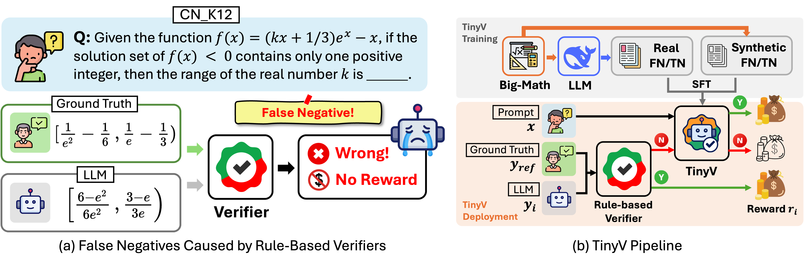

# TinyV

Official Repo for paper [**TinyV: Reducing False Negatives in Verification Improves RL for LLM Reasoning**](https://arxiv.org/abs/2505.14625). TinyV is a reward system for efficient RL post-training that detects false negatives in current rule-based verifiers and provides more accurate reward signals via a small LLM during RL training. Experiments show that TinyV incurs only 6% additional computational cost while significantly increasing both RL efficiency and final model performance.

- 📄 [Technical Report](https://arxiv.org/abs/2505.14625) - Including false negative analysis and theotical insights behind TinyV
- 💾 [Github Repo](https://github.com/uw-nsl/TinyV) - Access the complete pipeline for more efficient RL training via TinyV
- 🤗 [HF Collection](https://huggingface.co/collections/zhangchenxu/tinyv-682d5840c7e309217df625df) - Training Data, Benchmarks, and Model Artifact

## Overview


## Installation

Our RL framework is based on [Verl](https://github.com/volcengine/verl). To install our environment, you can use:

**Option 1**: conda
```
git clone https://github.com/uw-nsl/TinyV
cd TinyV
cd verl
conda create -n TinyV python=3.10 -y
conda activate TinyV
pip install -e .
pip install flash-attn --no-build-isolation
wandb login --verify [YOUR_WANDB_KEY]
```

**Option 2**: [uv](https://github.com/astral-sh/uv) (recommended!)
```
git clone https://github.com/uw-nsl/TinyV
cd TinyV
cd verl
uv venv
source .venv/bin/activate
uv pip install -e .
uv pip install flash-attn --no-build-isolation
wandb login --verify [YOUR_WANDB_KEY]
```

## Training

**1. RL with TinyV:** Please start your training from [run_grpo_tinyv.sh](./run_grpo_tinyv.sh). Since TinyV is integrated with Verl, you can simply follow Verl setups to define your hyperparameters. Specifically, there are two new arguments related to TinyV in the bash script:

```
VERIFIER_MODEL=${5:-"zhangchenxu/TinyV-1.5B"}
VERIFIER_SETUP=${6:-"addon"}
```
Configuration Options:

`VERIFIER_MODEL`: Specifies the TinyV model to use for verification. Default is `zhangchenxu/TinyV-1.5B`, but you can replace it with other TinyV model variants or your own fine-tuned verifier.

`VERIFIER_SETUP`: Defines how TinyV integrates with the training process. Options include:
- `addon` (default): TinyV works alongside existing rule-based verifiers. TinyV is triggered only when the rule-based verifier determines the answer is incorrect.
- `tinyv_only`: Uses TinyV exclusively for verification, without using rule-based verifiers entirely.

Important Note: If you intend to use TinyV, please add the suffix `_tinyv` to your data source name. Otherwise, it will fall back to the default verifier, which is Prime Math.

**2. TinyV Model Training:** If you want to create your own verifier, please refer to [tinyv_model_training_sft.sh](tinyv_model_training_sft.sh) for verifier SFT training. You need to install Llama-Factory enviroment as detailed [here](./llama_factory/).

## 🧐 Questions?

For questions, suggestions, or feedback, please reach out to [Zhangchen Xu](mailto:zxu9@uw.edu), or [raise an issue](https://github.com/uw-nsl/TinyV/issues/new). We welcome your input and are committed to continuously improving TinyV to better serve the community.

## 📚 Citation

If you find the model, data, or code useful, please cite:
```
@article{xu2025tinyv,
      title={TinyV: Reducing False Negatives in Verification Improves RL for LLM Reasoning}, 
      author={Zhangchen Xu and Yuetai Li and Fengqing Jiang and Bhaskar Ramasubramanian and Luyao Niu and Bill Yuchen Lin and Radha Poovendran},
      year={2025},
      eprint={2505.14625},
      archivePrefix={arXiv},
      primaryClass={cs.LG},
      url={https://arxiv.org/abs/2505.14625}, 
}
```
